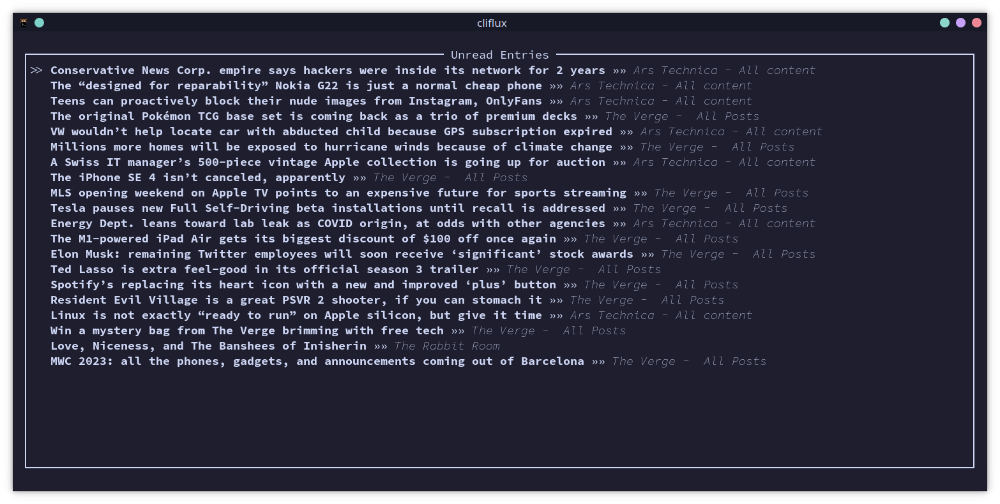
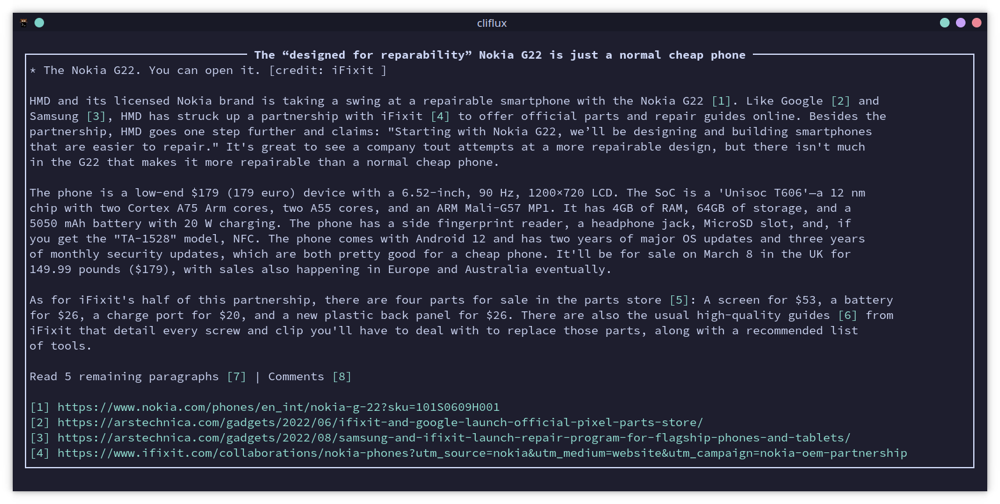
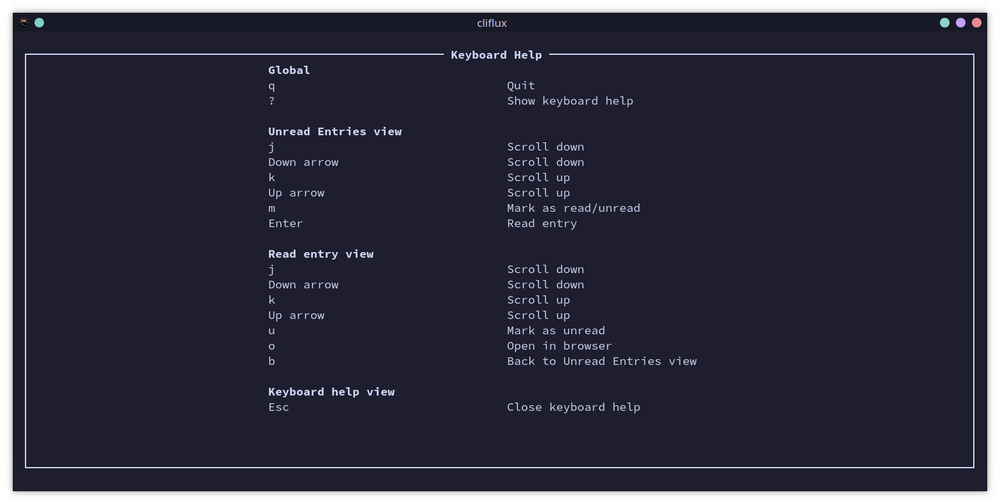

# cliflux

`cliflux` is a terminal-ui client for the [Miniflux](https://miniflux.app/) self-hosted RSS reader.

There are many good TUI/CLI RSS reader apps, but when I went looking, I couldn't find one that used Miniflux as its 
source for feeds, read/unread tracking, and "saved" feed entries.

So I built one! And that's what this is.

## Screenshots





## Installation

This package is built in Rust, so if you have that installed, you should be able to just run `cargo install cliflux` to install it.

Otherwise, grab a build for your OS from [the Releases page](https://github.com/spencerwi/cliflux/releases).

## Initial setup

You'll need to supply `cliflux` with two key pieces of configuration, in a TOML file called `config.toml` in
`$XDG_CONFIG_DIR/cliflux/` (see [this link](https://wiki.archlinux.org/title/XDG_Base_Directory) for details on what
those are if you're not familiar with the term. If you're on something unixy, this is most likely `$HOME/.config/`).

That TOML file should look like this:

```toml
server_url = "your-miniflux-server-url-here-including-port"
api_key = "your-miniflux-api-key-here"
```

To generate an API key for your Miniflux account, log into your Miniflux account on your server and go to 
"Settings" > "API Keys" > "Create a new API key"

## Usage

Once you've got your config file in place, just run `cliflux` and you'll see a list of feed entries fetched 
from your Miniflux server. Up/down arrows (or `k`/`j` for vim delinquents like me) navigate this list, `m` toggles 
the read/unread state of the article, `r` refreshes the list view, and "enter" opens an article for reading, at which 
point it'll be marked as read. 

While reading an article, `u` will mark it as unread, up/down arrows (or, again, `k`/`j`) will scroll up/down, "PageUp"
and "PageDown" will scroll faster, `o` will open the article in your browser, and `b` will go back to the main list view.

If all that seems like a lot to remember, you can hit `?` at any time and get a keyboard reference screen like this:



## License 

This software is provided under the MIT License. See [LICENSE.MD](./LICENSE.md).
